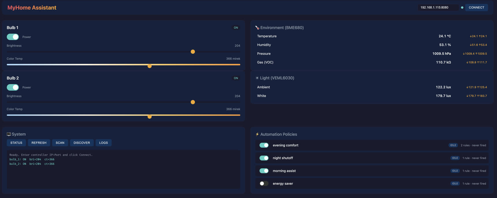

# MyHome Assistant
> Experiments with controlling things at home via ESP32+AtomVM+Erlang

Control Philips Hue Bluetooth light bulbs directly from an ESP32-S3 running
AtomVM/Erlang. No Hue Bridge required — communicates via BLE GATT.

<a href="myhome-assistant.jpg"></a>

Goto: [https://etnt.github.io/myhome-assistant/](https://etnt.github.io/myhome-assistant/)

or serve locally and open in a browser:

```bash
cd viz && python3 -m http.server 3000
# open http://localhost:3000
```

## Hardware

- ESP32-S3 development board
- Philips Hue Bluetooth bulbs (2019+ models with built-in BLE)

## Architecture

```
ESP32-S3 (AtomVM/Erlang)
  ├── myhome_top_sup (rest_for_one)
  │     ├── myhome_log (in-memory log ring buffer)
  │     ├── ble (gen_server, owns port, serializes all BLE commands)
  │     ├── myhome_event_bus (pub/sub for BLE events)
  │     └── myhome_sup (one_for_one)
  │           ├── myhome_scanner (subscribes to scan events)
  │           ├── myhome_ble_conn (connection state machine)
  │           ├── myhome_http (WiFi + tiny_httpd)
  │           ├── myhome_http_handler (request routing + tiny_json)
  │           ├── myhome_discovery (pairing + bulb startup)
  │           ├── bulb_1 (connect-on-demand) ─·BLE·─► Hue Bulb 1
  │           └── bulb_2 (connect-on-demand) ─·BLE·─► Hue Bulb 2
  └── ble_port (C, NimBLE)
```

Event flow: C port → `ble` process → `myhome_event_bus` → filtered subscribers.

BLE strategy: **connect-on-demand** — bulb gen_servers only establish a BLE
connection when a command is sent, then disconnect after 5s idle. This keeps
the radio free for WiFi when no light commands are active.

## Prerequisites

- [ESP-IDF](https://docs.espressif.com/projects/esp-idf/en/stable/esp32s3/get-started/) (v5.x)
- [rebar3](https://rebar3.org/)
- USB connection to your ESP32-S3

## Quick Start

```bash
# Build and flash everything (first time)
make flash

# Or step by step:
make atomvm          # Build AtomVM firmware with BLE component
make flash-firmware  # Flash firmware to ESP32-S3
make flash-app       # Build and flash the Erlang application
make monitor         # Open serial console
```

## Configuration

Override defaults (Mac) via environment or command line:

```bash
make flash PORT=/dev/cu.usbmodem5B414826621
make flash-app APP_OFFSET=0x250000
```

| Variable     | Default                      | Description                     |
|-------------|-----------------------------|---------------------------------|
| `PORT`      | `/dev/cu.usbmodem11101`     | Serial port for ESP32-S3        |
| `IDF_PATH`  | `~/esp/esp-idf`             | Path to ESP-IDF installation    |
| `APP_OFFSET`| `0x250000`                  | Flash offset for Erlang app     |

Run `make help` to see all targets.

## First Boot — Bulb Pairing

On first boot (no bulbs in NVS), the application starts but no bulbs are
controlled. You must trigger discovery manually:

1. Power-cycle your Hue bulbs (they enter pairing mode for ~30 seconds)
2. Trigger discovery via the HTTP API:
   ```bash
   curl -X POST http://<esp-ip>:8080/api/discover
   ```
3. The ESP32 scans for nearby BLE devices, then pairs with those that have "Hue" in their name
4. Addresses are stored in NVS for automatic reconnection on future boots

> **Note:** In case the bulbs has been paired before you may have to factory
> reset them; the safest way to do this is to user the `Phillips Hue` app
> and first add the bulbs (if not already added) then do factory reset on them

Monitor the serial console to follow the pairing process:

```bash
make monitor
```

## Usage

The bulbs are controlled via the HTTP API; via `minicom`
you'll see the obtained IP address, of the ESP32, being printed.

```bash
# Check status
curl http://<esp-ip>:8080/api/status

# Scan for nearby BLE devices (blocks until scan completes)
curl -X POST http://<esp-ip>:8080/api/scan -d '{"duration":10}'

# Get last scan results
curl http://<esp-ip>:8080/api/scan

# Trigger discovery and pairing of new Hue bulbs
curl -X POST http://<esp-ip>:8080/api/discover

# View system logs (newest first)
curl http://<esp-ip>:8080/api/logs

# Read actual bulb state (connects via BLE, reads GATT characteristics)
curl http://<esp-ip>:8080/api/bulb/1/state
# => {"status":"ok","power":true,"brightness":200,"color_temp":366}

# Set brightness (1-254)
curl -X POST http://<esp-ip>:8080/api/bulb/1/brightness -d '{"value":200}'

# Set color temperature (153-500 mirek, higher = warmer)
# 153 = cool daylight (6500K), 370 = neutral (2700K), 454 = candle (2200K)
curl -X POST http://<esp-ip>:8080/api/bulb/1/color_temp -d '{"value":370}'

# Set color via CIE 1931 XY chromaticity (0-65535, where 65535 = 1.0)
# Useful for saturated colors that can't be expressed as white temperature
curl -X POST http://<esp-ip>:8080/api/bulb/1/color_xy -d '{"x":30146,"y":26869}'

# Power off bulb 1
curl -X POST http://<esp-ip>:8080/api/bulb/1/power -d '{"on":false}'

# Power on bulb 1
curl -X POST http://<esp-ip>:8080/api/bulb/1/power -d '{"on":true}'

# Set multiple properties at once
curl -X POST http://<esp-ip>:8080/api/bulb/1/state \
  -d '{"power":true,"brightness":200,"color_temp":370}'

# Pretty print scan result
curl -s http://<esp-ip>:8080/api/scan | jq -r '.scan.results[] | select(.name != "") | "\(.addr) rssi=\(.rssi) \(.name)"'

# Pretty print the log output as oneliners
curl http://<esp-ip>:8080/api/logs | jq -r '.logs[] | "\(.ts) [\(.level)] \(.msg)"'

# Filter logs by level
curl http://<esp-ip>:8080/api/logs?level=error

# Limit number of entries
curl http://<esp-ip>:8080/api/logs?limit=20

# 1. Factory-reset the bulbs so they enter pairing mode
# 2. Then clear ESP32 bonds + config and reboot:
curl -X POST http://192.168.1.115:8080/api/reset
```

## Color Control

The Hue bulbs support two color modes: **color temperature** (Mirek) for
white tones, and **CIE XY** for full-gamut saturated colors.

### Color Temperature (Mirek)

The Mirek scale (also called "mired") is the standard unit for correlated
color temperature. It is the inverse of Kelvin, scaled by 1,000,000:

$$Mirek = \frac{1{,}000{,}000}{Kelvin}$$

The Hue BLE protocol accepts values **153–500**. Higher values = warmer light.

| Mirek | Kelvin | Description |
|-------|--------|-------------|
| 153   | 6500K  | Cool daylight (bluish white) |
| 250   | 4000K  | Neutral white (office lighting) |
| 370   | 2700K  | Warm white (standard incandescent) |
| 454   | 2200K  | Candle / sunset |
| 500   | 2000K  | Warmest (deep amber) |

```bash
curl -X POST http://<esp-ip>:8080/api/bulb/1/color_temp -d '{"value":454}'
```

### CIE 1931 XY Chromaticity

For saturated colors (red, green, blue, purple, etc.) that cannot be
expressed as a white temperature, use the XY endpoint. X and Y are
coordinates on the CIE 1931 chromaticity diagram:

- **X** = red–green axis (higher = more red/orange)
- **Y** = luminance/green axis (higher = more green/yellow)

Standard CIE values range 0.0–1.0. The Hue protocol scales them to
integers 0–65535:

$$X_{hue} = X_{cie} \times 65535$$

| Color              | CIE (x, y) | Hue API (x, y) |
|--------------------|------------|----------------|
| Warm white (2700K) | 0.46, 0.41 | 30146, 26869   |
| Candle (2000K).    | 0.53, 0.41 | 34734, 26869   |
| Saturated red      | 0.68, 0.32 | 44564, 20971   |
| Saturated green    | 0.21, 0.71 | 13762, 46530   |
| Saturated blue     | 0.15, 0.06 | 9830, 3932     |
| Purple / magenta   | 0.32, 0.15 | 20971, 9830    |
| Orange             | 0.58, 0.38 | 38010, 24903   |
| D65 daylight white | 0.31, 0.33 | 20316, 21627   |

```bash
# Saturated red
curl -X POST http://<esp-ip>:8080/api/bulb/1/color_xy -d '{"x":44564,"y":20971}'

# Purple
curl -X POST http://<esp-ip>:8080/api/bulb/1/color_xy -d '{"x":20971,"y":9830}'
```

> **Tip:** For everyday warm/cool white lighting, use `color_temp` — it's
> simpler and designed for white tones. Use `color_xy` when you want actual
> colors (party mode, accent lighting, etc.).

> **Note:** The bulb operates in one color mode at a time. Setting
> `color_temp` switches to white mode; setting `color_xy` switches to
> chromaticity mode. Reading state only returns a meaningful value for the
> currently active mode.


## Troubleshooting

### `ATT_ERR_INSUFFICIENT_AUTHENTICATION` (error code 5)

GATT writes are rejected because the connection is not encrypted/bonded.

**Symptoms:**
- `{"reason": "{ble_error,<<5>>}", "status": "error"}` from HTTP API
- Serial log shows `encryption change: handle=N status=1285`
- Discovery reports "connected (bond pending)" instead of "bonded!"

**Causes:**
1. The bulb is already bonded to another device (phone/tablet). Hue BLE
   bulbs only support one bond at a time.
2. The bulb was not in pairing mode during discovery.

**Fix:**
1. Remove the bulbs from the Hue Bluetooth app on your phone (if paired).
2. Factory-reset the bulbs, see earlier note.
3. Rebuild and flash firmware + app: `make flash`
4. The bulbs enter pairing mode for ~30s after reset

### Timeout errors on first GATT write

The first write to a bulb after connection takes longer (~5-10s) because
NimBLE performs GATT service discovery to resolve characteristic handles.

**Symptoms:**
- `{timeout, {gen_server, call, ...}}` on first command
- Subsequent commands work fine

**Fix:** This is expected on the first write after connection. The API uses
a 15-second timeout to accommodate this. If you still see timeouts, check
that the bulb is within BLE range.

### Serial port busy during flash

```
Could not open /dev/cu.usbmodemXXX, the port is busy
```

Close minicom (or any serial monitor) before flashing:
```bash
pkill minicom
make flash-app
```

### WiFi beacon timeouts

```
WIFI_EVENT_STA_BEACON_TIMEOUT received
```

The ESP32-S3 has a single 2.4 GHz radio shared between WiFi and BLE.
ESP-IDF's software coexistence layer (`CONFIG_ESP_COEX_SW_COEXIST_ENABLE`)
arbitrates access using time-division multiplexing — when both are active,
each gets alternating ~50% time slices within a coexistence period.

We mitigate interference in three ways:

1. **Connect-on-demand** — BLE connections are only active during lamp
   operations (typically <2s), then disconnected after 5s idle. WiFi has
   100% radio access the rest of the time.
2. **Core pinning** — the BT controller and NimBLE host are pinned to
   core 1, while the WiFi task runs on core 0. This eliminates CPU
   contention between the two stacks.
3. **ESP-IDF coexistence** — the firmware enables the SW coexist module,
   which uses dynamic priority so high-priority WiFi beacons can preempt
   BLE time slices when needed.

If you still see beacon timeouts, move the ESP32 closer to the WiFi
access point or reduce the idle disconnect timeout.


## Project Structure

```
├── Makefile                  Build automation (make help)
├── rebar.config              Erlang build config + deps
├── patches/
│   └── sdkconfig.defaults.in.patch   AtomVM Kconfig patch (see below)
├── src/
│   ├── myhome_app.erl        Application entry point (start/0)
│   ├── myhome_top_sup.erl    Top-level supervisor (rest_for_one)
│   ├── myhome_log.erl        In-memory log server (ring buffer via queue)
│   ├── ble.erl               BLE port server (owns port, serializes commands)
│   ├── myhome_event_bus.erl  Pub/sub event bus for BLE events
│   ├── myhome_sup.erl        Secondary supervisor (one_for_one)
│   ├── myhome_scanner.erl    On-demand BLE device scanner
│   ├── myhome_ble_conn.erl   Connection state machine + sync connect
│   ├── myhome_http.erl       WiFi connection + HTTP listener
│   ├── myhome_http_handler.erl  HTTP API request routing
│   ├── myhome_discovery.erl  BLE pairing + dynamic bulb startup
│   └── myhome_hue_ble.erl    Per-bulb gen_server, Hue BLE protocol
├── nifs/ble/
│   ├── CMakeLists.txt         ESP-IDF component build
│   ├── include/ble_port.h     Port driver header
│   └── ble_port.c            NimBLE port driver (scan/connect/GATT)
└── plans/
    └── philips_hue_control.md Detailed implementation plan
```

### Dependencies

| Package | Source | Purpose |
|---------|--------|---------|
| `tiny_httpd` | [github.com/etnt/tiny-httpd](https://github.com/etnt/tiny-httpd) | Minimal HTTP/1.1 server + JSON encoder/decoder |

Fetched automatically by rebar3 from `rebar.config`.

### AtomVM Kconfig Patch

AtomVM ships without Bluetooth enabled. The file
`patches/sdkconfig.defaults.in.patch` is applied to AtomVM's
`sdkconfig.defaults.in` at build time (via `make atomvm`) to add:

- **NimBLE stack** — enables BLE central + observer roles for scanning and
  connecting to Hue bulbs
- **Security manager** — legacy and secure-connections pairing with NVS bond
  persistence (Hue bulbs require encrypted links)
- **RF coexistence** — enables ESP-IDF's software coexistence module for
  time-division multiplexing of the shared 2.4 GHz radio between WiFi and BLE
- **Core pinning** — BT controller and NimBLE host pinned to core 1, WiFi to
  core 0, eliminating CPU contention between the two stacks

After changing the patch you must do a full rebuild: `rm -rf AtomVM/src/platforms/esp32/build && make flash`.

## References

[AtomVM](https://doc.atomvm.org/latest/)

[BLE](https://learn.adafruit.com/introduction-to-bluetooth-low-energy/introduction)

[hello_atomvm_ble_switchbot](https://github.com/piyopiyoex/hello_atomvm_ble_switchbot)

## License

Apache-2.0
