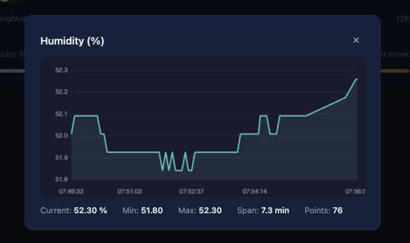
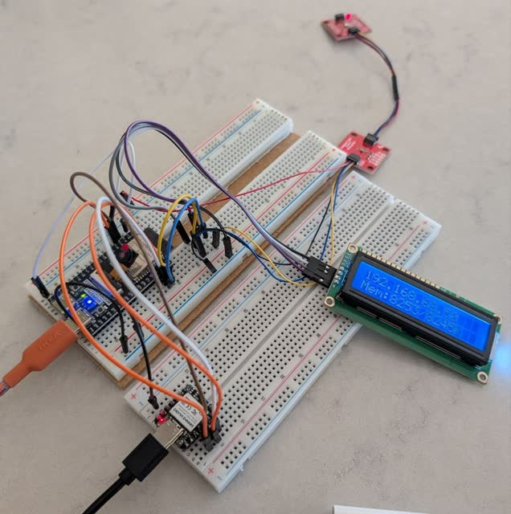
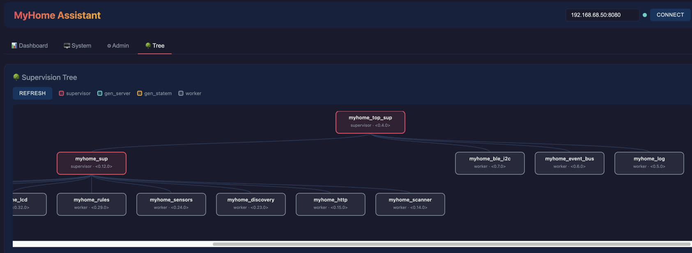

# MyHome Assistant
> Experiments with controlling things at home via ESP32+AtomVM+Erlang

Control Philips Hue Bluetooth light bulbs directly from an ESP32-S3 running
AtomVM/Erlang. No Hue Bridge required — communicates via BLE GATT.

<a href="screenshots/myhome-assistant.jpg"></a>
<a href="screenshots/myhome-assistant-graph.jpg"></a>


Goto: [https://etnt.github.io/myhome-assistant/](https://etnt.github.io/myhome-assistant/)

or serve locally and open in a browser:

```bash
cd viz && python3 -m http.server 3000
# open http://localhost:3000
```

> **Note:** This project started with just an ESP32-S3 but then expanded to
> an architecture which also make use of the XIAO-nRF52840 Bluetooth module.
> The first approach can be found in the branch: **esp32-s3-only** and the
> latter (current) approach exists in the **main** branch.

## Hardware

- ESP32-S3 development board
- Seed XIAO nRF52840 Bluetooth module
- Philips Hue Bluetooth bulbs (2019+ models with built-in BLE)
- Sensors: VEML6039, BME680
- 16x2 LCD with I2C (PCF8574) backpack — status display (optional)

<a href="screenshots/myhome-assistant-hw.jpg"></a>

## Architecture

The system spans two chips: the **ESP32-S3** runs WiFi and the Erlang
application, while a **XIAO nRF52840** acts as a dedicated BLE bridge. They
talk over a shared I2C bus (register protocol + a GPIO interrupt line for
async events), owned by `myhome_ble_i2c`.

```
ESP32-S3 (AtomVM/Erlang)
  └── myhome_top_sup (rest_for_one)
        ├── myhome_log         in-memory log ring buffer
        ├── myhome_event_bus   pub/sub for BLE + sensor events
        ├── myhome_ble_i2c     owns the shared I2C bus; BLE register
        │                      protocol to the XIAO + GPIO IRQ draining
        └── myhome_sup (one_for_one)
              ├── myhome_scanner    BLE scans via the XIAO bridge
              ├── myhome_http       WiFi + tiny_httpd REST API
              ├── myhome_discovery  pairing + dynamic bulb startup
              ├── myhome_sensors    BME680 + VEML6030 readings
              ├── myhome_rules      lux / temp / time automation engine
              ├── myhome_lcd        16x2 status display (IP + free heap)
              ├── bulb_1 (myhome_hue_ble) ┐  persistent Hue control over
              └── bulb_2 (myhome_hue_ble) ┘  always-on links (added by discovery)

Shared I2C bus (owned by myhome_ble_i2c):
  0x08  XIAO nRF52840  — BLE bridge (scan/connect/GATT) + IRQ line
  0x77  BME680         — temperature / humidity / pressure / VOC
  0x48  VEML6030       — ambient + white lux
  0x27  PCF8574        — 1602 LCD backpack (or 0x3F)

XIAO nRF52840 (Zephyr firmware) ──BLE GATT──► Philips Hue bulbs
```

`myhome_http_handler` is not a supervised child — `tiny_httpd` spawns one
handler process per request to route the REST API.

Event flow: the XIAO raises the GPIO IRQ → `myhome_ble_i2c` drains queued
events over I2C → `myhome_event_bus` → filtered subscribers (scanner, bulbs,
LCD, …).

BLE strategy: **persistent connections** — the XIAO nRF52840 keeps every
bonded Hue bulb connected and encrypted at all times. On boot (and whenever a
bulb drops) it auto-reconnects by scanning for the bonded address and
re-establishing the encrypted link, so a light command always has a live
connection to run on. The ESP32 holds no BLE radio of its own; it simply
issues commands over I2C and reacts to `ble_connected` / `ble_enc_change` /
`ble_disconnected` events.

Resilience: if the ESP32 reboots, the XIAO keeps its links up and the ESP32
re-adopts them on startup via `CMD_LIST_CONNECTIONS`. If the XIAO itself
resets or crashes, it re-emits an `EVT_READY`; `myhome_ble_i2c` detects the
re-ready, drops its stale connection view, and re-adopts links as the XIAO's
auto-reconnect brings each bulb back. `GET /api/ble/status` reports the nRF
firmware version, uptime, and the currently connected/encrypted bulbs.


## Supervision Tree

The web UI can draw the live Erlang supervision tree, so you can see exactly
how the running processes are connected — supervisors, their children, and
the dynamically started bulb gen_servers. Open the **🌳 Tree** tab and click
**Refresh**.

<a href="screenshots/myhome-assistant-suptree.jpg"></a>

The tree is built on the device by walking the supervisors from
`myhome_top_sup` with `supervisor:which_children/1` and exposed via
`GET /api/suptree` as nested JSON. The browser then lays it out and renders it
as a dependency-free SVG graph (no external libraries). Each node shows the
process id / registered name and pid; hover a node to see its callback
module(s). Node colors distinguish the process kind:

| Color  | Kind         | Meaning                                     |
|--------|--------------|---------------------------------------------|
| Red    | `supervisor` | A supervisor that starts/monitors children  |
| Teal   | `gen_server` | A standard `gen_server` worker              |
| Orange | `gen_statem` | A `gen_statem` state-machine worker         |
| Grey   | `worker`     | Any other worker process                    |

> **Note:** Behaviour detection (the teal/orange colors) relies on
> `process_info/2`'s `current_function` key, which AtomVM does not support.
> On the device every worker therefore shows up grey as `worker`; supervisors
> are always distinguished. The richer coloring appears when the same endpoint
> is served from desktop Erlang/OTP.

## Automation Rules

The system includes a rules engine that automatically controls lights based on
sensor readings (lux, temperature) and time-of-day. Rules are timezone-aware
and designed for Nordic latitudes where sunset varies dramatically by season.

See [AUTOMATION_RULES.md](AUTOMATION_RULES.md) for how to write and configure
rule policies.

## Prerequisites

- [ESP-IDF](https://docs.espressif.com/projects/esp-idf/en/stable/esp32s3/get-started/) (v5.x)
- [rebar3](https://rebar3.org/)
- USB connection to your ESP32-S3

## Quick Start

```bash
# Build and flash everything (first time)
make flash

# Or step by step:
make atomvm          # Build AtomVM firmware with BLE component
make flash-firmware  # Flash firmware to ESP32-S3
make flash-app       # Build and flash the Erlang application
make monitor         # Open serial console
```

## Build the XIAO nRF52840 firmware

The [BUILD_SETUP](firmware/xiao_ble/BUILD_SETUP.md) describe how to build the
`zephyr.uf2`.

## Configuration

Override defaults (Mac) via environment or command line:

```bash
make flash PORT=/dev/cu.usbmodem5B414826621
make flash-app APP_OFFSET=0x250000
```

| Variable     | Default                      | Description                     |
|-------------|-----------------------------|---------------------------------|
| `PORT`      | `/dev/cu.usbmodem11101`     | Serial port for ESP32-S3        |
| `IDF_PATH`  | `~/esp/esp-idf`             | Path to ESP-IDF installation    |
| `APP_OFFSET`| `0x250000`                  | Flash offset for Erlang app     |

Run `make help` to see all targets.

## First Boot — Bulb Pairing

On first boot (no bulbs in NVS), the application starts but no bulbs are
controlled. You must trigger discovery manually:

1. Power-cycle your Hue bulbs (they enter pairing mode for ~30 seconds)
2. Trigger discovery via the HTTP API:
   ```bash
   curl -X POST http://<esp-ip>:8080/api/discover
   ```
3. The ESP32 scans for nearby BLE devices, then pairs with those that have "Hue" in their name
4. Addresses are stored in NVS for automatic reconnection on future boots

> **Note:** In case the bulbs has been paired before you may have to factory
> reset them; the safest way to do this is to user the `Phillips Hue` app
> and first add the bulbs (if not already added) then do factory reset on them

Monitor the serial console to follow the pairing process:

```bash
make monitor
```

## Usage

The bulbs are controlled via the HTTP API; via `minicom`
you'll see the obtained IP address, of the ESP32, being printed.

### Status Display (LCD)

An optional 16x2 character LCD (HD44780 with a PCF8574 I2C backpack) shows
live status without needing the serial console:

```
┌────────────────┐
│192.168.68.50   │  line 0: device IP address ("No IP" until WiFi is up)
│Mem:8266/8100K  │  line 1: free heap KB — current / minimum-ever
└────────────────┘
```

Line 1 shows two numbers in KB: the **current** free heap (fluctuates with
activity) and the **minimum** free heap seen since boot (worst-case headroom
and a slow-leak indicator). Both lines refresh once a minute.

**Wiring** — the LCD shares the same I2C bus as the sensors and the XIAO
bridge (driven by `myhome_lcd` via the `lcd1602` driver in `atomvm_sensors`):

| LCD backpack | ESP32-S3        |
|--------------|-----------------|
| `VCC`        | **5V** (see note)|
| `GND`        | `GND`           |
| `SDA`        | shared I2C `SDA`|
| `SCL`        | shared I2C `SCL`|

> **Note — power it from 5V.** The PCF8574 expander works at 3.3V (so the
> address ACKs and the backlight lights up), but the HD44780 LCD glass needs
> ~5V to develop enough contrast — at 3.3V you get a lit backlight but no
> visible characters even with the contrast trimpot maxed. Because the
> backpack's I2C pull-ups go to `VCC`, powering it at 5V pulls `SDA`/`SCL` to
> 5V, which exceeds the ESP32-S3's 3.6V GPIO limit. For an in-spec setup
> either remove the backpack's two pull-up resistors (rely on the 3.3V bus
> pull-ups) or use a bidirectional I2C level shifter.

The driver auto-detects the backpack at `0x27` (PCF8574) or `0x3F`
(PCF8574A). On boot it runs a backlight blink test and writes a row of solid
blocks for a few seconds — turn the contrast trimpot until the blocks are
crisp. Detection and init progress are printed to the serial console
(`[lcd] ...`). The display is optional: if no backpack is found the rest of
the system runs normally.

### REST API

| Method | Endpoint                   | Body                    | Description                |
|--------|----------------------------|-------------------------|----------------------------|
| GET    | `/api/status`              | —                       | List registered bulbs and connection state |
| GET    | `/api/suptree`             | —                       | Erlang supervision tree as nested JSON (drawn in the UI) |
| GET    | `/api/scan`                | —                       | Get last BLE scan results |
| POST   | `/api/scan`                | `{"duration":10}`       | Trigger a BLE scan (blocks until done) |
| POST   | `/api/discover`            | —                       | Scan, pair, and register new Hue bulbs |
| POST   | `/api/reset`               | —                       | Factory reset (clear NVS + reboot) |
| GET    | `/api/logs`                | —                       | System logs (params: `level`, `limit`) |
| GET    | `/api/sensors`             | —                       | Current readings from all sensors |
| GET    | `/api/sensors/{type}`      | —                       | Readings for a single sensor type |
| GET    | `/api/bulb/{n}/state`      | —                       | Cached bulb state (no BLE, instant) |
| POST   | `/api/bulb/{n}/refresh`    | —                       | Live BLE GATT read (connects on-demand) |
| POST   | `/api/bulb/{n}/power`      | `{"on":true}`           | Turn bulb on/off |
| POST   | `/api/bulb/{n}/brightness` | `{"value":200}`         | Set brightness (1–254) |
| POST   | `/api/bulb/{n}/color_temp` | `{"value":370}`         | Set color temp (153–500 mirek) |
| POST   | `/api/bulb/{n}/color_xy`   | `{"x":30146,"y":26869}` | Set CIE 1931 XY color |
| POST   | `/api/bulb/{n}/state`      | `{"power":true,...}`    | Set multiple properties at once |
| POST   | `/api/bulb/{n}/name`       | `{"name":"Kitchen"}`    | Set a bulb's display name (stored in NVS) |
| DELETE | `/api/bulb/{n}`            | —                       | Remove bulb from NVS and stop process |
| GET    | `/api/nvs/dump`            | —                       | Dump all bulb NVS config (addr + name) |
| POST   | `/api/nvs/restore`         | `{"bulb_1_addr":"AA:B...` | Restore bulb config to NVS |
| GET    | `/api/policies`            | —                       | List automation policies and status |
| POST   | `/api/policies/{id}/enable` | —                      | Enable an automation policy |
| POST   | `/api/policies/{id}/disable` | —                     | Disable an automation policy |
| GET    | `/api/events`              | —                       | Long-poll for real-time events (30s timeout) |
| POST   | `/api/reconnect`           | —                       | Clear connect cooldown on all bulbs |
| POST   | `/api/bulb/{n}/reconnect`  | —                       | Clear connect cooldown on a single bulb |
| DELETE | `/api/bulb/{n}/bond`       | —                       | Delete the BLE bond (stored key) for a bulb on the nRF |

#### Low-level BLE debug endpoints

These operate directly on the XIAO BLE bridge by address/handle and are
intended for debugging the connection/GATT layer.

| Method | Endpoint              | Body                                   | Description                   |
|--------|-----------------------|----------------------------------------|-------------------------------|
| POST   | `/api/connect`        | `{"addr":"AA:BB:...","addr_type":1}`   | Connect to a device by address (`addr_type` 0–3, default 1) |
| POST   | `/api/disconnect`     | `{"handle":1}`                         | Disconnect a connection handle |
| POST   | `/api/bond`           | `{"handle":1}`                         | Initiate bonding/encryption on a handle |
| POST   | `/api/gatt/discover`  | `{"handle":1}`                         | Discover GATT characteristics |
| POST   | `/api/gatt/read`      | `{"handle":1,"attr":12}`               | Read a GATT characteristic |
| POST   | `/api/gatt/write`     | `{"handle":1,"attr":12,"data":"01a0"}` | Write a GATT characteristic, hex data (with response) |
| POST   | `/api/gatt/write_nr`  | `{"handle":1,"attr":12,"data":"01a0"}` | Write a GATT characteristic, hex data (no response) |

### Examples

```bash
# Check status
curl http://<esp-ip>:8080/api/status

# Scan for nearby BLE devices (blocks until scan completes)
curl -X POST http://<esp-ip>:8080/api/scan -d '{"duration":10}'

# Get last scan results
curl http://<esp-ip>:8080/api/scan

# Trigger discovery and pairing of new Hue bulbs
curl -X POST http://<esp-ip>:8080/api/discover

# View system logs (newest first)
curl http://<esp-ip>:8080/api/logs

# Read actual bulb state (connects via BLE, reads GATT characteristics)
curl -X POST http://<esp-ip>:8080/api/bulb/1/refresh
# => {"status":"ok","power":true,"brightness":200,"color_temp":366}

# Get cached bulb state (no BLE connection, instant)
curl http://<esp-ip>:8080/api/bulb/1/state
# => {"status":"ok","power":true,"brightness":200,"color_temp":366}

# Set brightness (1-254)
curl -X POST http://<esp-ip>:8080/api/bulb/1/brightness -d '{"value":200}'

# Set color temperature (153-500 mirek, higher = warmer)
# 153 = cool daylight (6500K), 370 = neutral (2700K), 454 = candle (2200K)
curl -X POST http://<esp-ip>:8080/api/bulb/1/color_temp -d '{"value":370}'

# Set color via CIE 1931 XY chromaticity (0-65535, where 65535 = 1.0)
# Useful for saturated colors that can't be expressed as white temperature
curl -X POST http://<esp-ip>:8080/api/bulb/1/color_xy -d '{"x":30146,"y":26869}'

# Power off bulb 1
curl -X POST http://<esp-ip>:8080/api/bulb/1/power -d '{"on":false}'

# Power on bulb 1
curl -X POST http://<esp-ip>:8080/api/bulb/1/power -d '{"on":true}'

# Set multiple properties at once
curl -X POST http://<esp-ip>:8080/api/bulb/1/state \
  -d '{"power":true,"brightness":200,"color_temp":370}'

# Remove a bulb (erases from NVS, stops process)
curl -X DELETE http://<esp-ip>:8080/api/bulb/3

# Unpair a bulb (delete its BLE bond on the nRF) — fixes pairing mismatches.
# After this, factory-reset the bulb, then re-discover or send a command.
curl -X DELETE http://<esp-ip>:8080/api/bulb/2/bond

# Pretty print scan result
curl -s http://<esp-ip>:8080/api/scan | jq -r '.scan.results[] | select(.name != "") | "\(.addr) rssi=\(.rssi) \(.name)"'

# Pretty print the log output as oneliners
curl http://<esp-ip>:8080/api/logs | jq -r '.logs[] | "\(.ts) [\(.level)] \(.msg)"'

# Filter logs by level
curl http://<esp-ip>:8080/api/logs?level=error

# Limit number of entries
curl http://<esp-ip>:8080/api/logs?limit=20

# Dump the NVS store (before flash or reset)
curl http://192.168.1.115:8080/api/nvs/dump > nvs_backup.json
# Restore the NVS store
curl -X POST http://192.168.1.115:8080/api/nvs/restore -d @nvs_backup.json

# 1. Factory-reset the bulbs so they enter pairing mode
# 2. Then clear ESP32 bonds + config and reboot:
curl -X POST http://192.168.1.115:8080/api/reset
```

## Web UI

A single-page dashboard served from `viz/index.html` provides a visual
interface to the system. Serve it locally or access via GitHub Pages:

```bash
cd viz && python3 -m http.server 3000
# open http://localhost:3000
```

Enter the ESP32's IP:Port (e.g. `192.168.1.115:8080`) and click **Connect**.

### Features

- **Bulb controls** — power toggle, brightness slider, and color temperature
  slider for each discovered bulb
- **BLE scanner** — trigger scans and view nearby devices
- **System logs** — live view of the on-device log ring buffer
- **Sensor cards** — real-time readings from BME680 (temperature, humidity,
  pressure, VOC), SGP30 (eCO₂, TVOC), and VEML6030 (ambient/white lux)
  with min/max tracking
- **Metric history graphs** — click any sensor metric to open a chart popup
  showing the last ~30 minutes of readings (stored in a 360-point ring
  buffer, updated every 5 seconds)

The UI is self-contained (no build step, no external dependencies) and
communicates with the ESP32 via the REST API described above.

### Event-Driven Updates (Long-Polling)

The UI uses **long-polling** via `GET /api/events` instead of periodic
polling. The ESP32 holds the HTTP connection open (up to 30s) and returns
immediately when a relevant event occurs:

- `sensor_update` — new sensor readings available
- `policy_changed` — an automation policy was enabled/disabled
- `bulb_state` — a bulb's power/brightness/color changed (detected by the
  built-in heartbeat poller every ~5 minutes)

This reduces WiFi traffic and gives near-instant UI feedback without
continuous polling. The `tiny_httpd` server spawns one process per
connection, so the long-poll blocks only its own handler process.

### Heartbeat & Reconnect

Each bulb gen_server runs a **heartbeat timer** (every 5 minutes + random
jitter) that reads the bulb's BLE state to detect external changes (e.g.
wall switch toggled). If the bulb is unreachable, a 60-second **connect
cooldown** prevents retry storms that could exhaust ESP32 RAM.

Use `POST /api/reconnect` (all bulbs) or `POST /api/bulb/{n}/reconnect`
(single bulb) to clear the cooldown and retry immediately.

## Color Control

The Hue bulbs support two color modes: **color temperature** (Mirek) for
white tones, and **CIE XY** for full-gamut saturated colors.

### Color Temperature (Mirek)

The Mirek scale (also called "mired") is the standard unit for correlated
color temperature. It is the inverse of Kelvin, scaled by 1,000,000:

$$Mirek = \frac{1{,}000{,}000}{Kelvin}$$

The Hue BLE protocol accepts values **153–500**. Higher values = warmer light.

| Mirek | Kelvin | Description |
|-------|--------|-------------|
| 153   | 6500K  | Cool daylight (bluish white) |
| 250   | 4000K  | Neutral white (office lighting) |
| 370   | 2700K  | Warm white (standard incandescent) |
| 454   | 2200K  | Candle / sunset |
| 500   | 2000K  | Warmest (deep amber) |

```bash
curl -X POST http://<esp-ip>:8080/api/bulb/1/color_temp -d '{"value":454}'
```

### CIE 1931 XY Chromaticity

For saturated colors (red, green, blue, purple, etc.) that cannot be
expressed as a white temperature, use the XY endpoint. X and Y are
coordinates on the CIE 1931 chromaticity diagram:

- **X** = red–green axis (higher = more red/orange)
- **Y** = luminance/green axis (higher = more green/yellow)

Standard CIE values range 0.0–1.0. The Hue protocol scales them to
integers 0–65535:

$$X_{hue} = X_{cie} \times 65535$$

| Color              | CIE (x, y) | Hue API (x, y) |
|--------------------|------------|----------------|
| Warm white (2700K) | 0.46, 0.41 | 30146, 26869   |
| Candle (2000K).    | 0.53, 0.41 | 34734, 26869   |
| Saturated red      | 0.68, 0.32 | 44564, 20971   |
| Saturated green    | 0.21, 0.71 | 13762, 46530   |
| Saturated blue     | 0.15, 0.06 | 9830, 3932     |
| Purple / magenta   | 0.32, 0.15 | 20971, 9830    |
| Orange             | 0.58, 0.38 | 38010, 24903   |
| D65 daylight white | 0.31, 0.33 | 20316, 21627   |

```bash
# Saturated red
curl -X POST http://<esp-ip>:8080/api/bulb/1/color_xy -d '{"x":44564,"y":20971}'

# Purple
curl -X POST http://<esp-ip>:8080/api/bulb/1/color_xy -d '{"x":20971,"y":9830}'
```

> **Tip:** For everyday warm/cool white lighting, use `color_temp` — it's
> simpler and designed for white tones. Use `color_xy` when you want actual
> colors (party mode, accent lighting, etc.).

> **Note:** The bulb operates in one color mode at a time. Setting
> `color_temp` switches to white mode; setting `color_xy` switches to
> chromaticity mode. Reading state only returns a meaningful value for the
> currently active mode.

## MCP Server

A Python-based [Model Context Protocol](https://modelcontextprotocol.io/)
server (`mcp_server/`) exposes the device's REST API as MCP tools, allowing
AI assistants (GitHub Copilot, Claude, etc.) to control lights, read sensors,
and manage automation policies directly.

### Setup

```bash
cd mcp_server
python3 -m venv .venv
source .venv/bin/activate
pip install -r requirements.txt
```

### VS Code Integration

The workspace includes `.vscode/mcp.json` which configures the server
automatically. The device URL is set via the `MYHOME_DEVICE_URL` environment
variable (defaults to `http://192.168.1.115:8080`).

### Available Tools

| Tool | Description |
|------|-------------|
| `get_status` | Device status and bulb list |
| `get_sensors` | Current sensor readings |
| `get_logs` | System log entries |
| `get_scan_results` | Last BLE scan results |
| `trigger_scan` | Start a new BLE scan |
| `discover_bulbs` | Run bulb discovery/pairing |
| `get_bulb_state` | Cached bulb state |
| `refresh_bulb_state` | Live BLE GATT read |
| `set_bulb_power` | Turn bulb on/off |
| `set_bulb_brightness` | Set brightness (1–254) |
| `set_bulb_color_temp` | Set color temperature (153–500 mirek) |
| `set_bulb_color_xy` | Set CIE xy color |
| `set_bulb_state` | Set multiple properties at once |
| `list_policies` | List automation policies |
| `enable_policy` | Enable a policy |
| `disable_policy` | Disable a policy |


## Troubleshooting

### `ATT_ERR_INSUFFICIENT_AUTHENTICATION` (error code 5)

GATT writes are rejected because the connection is not encrypted/bonded.

**Symptoms:**
- `{"reason": "{ble_error,<<5>>}", "status": "error"}` from HTTP API
- Serial log shows `encryption change: handle=N status=1285`
- Discovery reports "connected (bond pending)" instead of "bonded!"

**Causes:**
1. The bulb is already bonded to another device (phone/tablet). Hue BLE
   bulbs only support one bond at a time.
2. The bulb was not in pairing mode during discovery.

**Fix:**
1. Remove the bulbs from the Hue Bluetooth app on your phone (if paired).
2. Factory-reset the bulbs, see earlier note.
3. Rebuild and flash firmware + app: `make flash`
4. The bulbs enter pairing mode for ~30s after reset

### Single bulb stuck with `status=9` bonding failure

One bulb repeatedly fails to bond (`BLE bonding failed: status=9`, then
disconnects with `reason=0x3E`) while the others work. This is a **bond
mismatch**: the nRF still holds a stored key (LTK) for that bulb, but the
bulb's side of the bond was lost or changed.

**Fix:**
1. Delete the stale bond on the nRF for just that bulb:
   ```bash
   curl -X DELETE http://<esp-ip>:8080/api/bulb/{n}/bond
   ```
   (or click **Unpair** on the bulb card in the Web UI)
2. Factory-reset the bulb so it forgets its old bond too.
3. Re-pair: `curl -X POST http://<esp-ip>:8080/api/discover` (or just send a
   command — the bulb will pair fresh on the next connection).

### Timeout errors on first GATT write

The first write to a bulb after connection takes longer (~5-10s) because
the XIAO bridge performs GATT service discovery to resolve characteristic
handles.

**Symptoms:**
- `{timeout, {gen_server, call, ...}}` on first command
- Subsequent commands work fine

**Fix:** This is expected on the first write after connection. The API uses
a 15-second timeout to accommodate this. If you still see timeouts, check
that the bulb is within BLE range.

### Serial port busy during flash

```
Could not open /dev/cu.usbmodemXXX, the port is busy
```

Close minicom (or any serial monitor) before flashing:
```bash
pkill minicom
make flash-app
```

### WiFi beacon timeouts

```
WIFI_EVENT_STA_BEACON_TIMEOUT received
```

With BLE offloaded to the XIAO nRF52840, the ESP32-S3 radio is dedicated to
WiFi, so on-chip WiFi/BLE radio contention is no longer a factor. Occasional
beacon timeouts are typically just weak signal — move the ESP32 closer to the
WiFi access point or reduce 2.4 GHz interference.


## Project Structure

```
├── Makefile                  Build automation (make help)
├── rebar.config              Erlang build config + deps
├── patches/
│   └── sdkconfig.defaults.in.patch   AtomVM Kconfig patch (see below)
├── src/
│   ├── myhome_app.erl        Application entry point (start/0)
│   ├── myhome_top_sup.erl    Top-level supervisor (rest_for_one)
│   ├── myhome_log.erl        In-memory log server (ring buffer via queue)
│   ├── myhome_event_bus.erl  Pub/sub event bus for BLE + sensor events
│   ├── myhome_ble_i2c.erl    Owns the shared I2C bus; BLE register protocol
│   │                         to the XIAO bridge + GPIO IRQ draining
│   ├── myhome_sup.erl        Secondary supervisor (one_for_one)
│   ├── myhome_scanner.erl    On-demand BLE device scanner (via the bridge)
│   ├── myhome_http.erl       WiFi + HTTP listener (exposes get_ip/0)
│   ├── myhome_http_handler.erl  HTTP API request routing
│   ├── myhome_discovery.erl  BLE pairing + dynamic bulb startup
│   ├── myhome_hue_ble.erl    Per-bulb gen_server, Hue BLE protocol
│   ├── myhome_sensors.erl    BME680 + VEML6030 polling (atomvm_sensors)
│   ├── myhome_rules.erl      Automation engine (lux / temp / time policies)
│   ├── myhome_lcd.erl        16x2 LCD status display (IP + free heap)
│   ├── myhome_time.erl       Timezone-aware local time helpers
│   └── myhome_config.erl     Runtime config (WiFi creds, ports; see template)
├── firmware/xiao_ble/        XIAO nRF52840 Zephyr BLE-bridge firmware
│   ├── BUILD_SETUP.md         How to build zephyr.uf2
│   ├── prj.conf               Zephyr project config
│   └── src/                   Bridge sources (I2C target + BLE central)
├── docs/                     Protocol + design notes (e.g. I2C protocol)
└── plans/                    Implementation plans (Hue control, BLE offload, …)
```


### Dependencies

| Package | Source | Purpose |
|---------|--------|---------|
| `tiny_httpd` | [github.com/etnt/tiny-httpd](https://github.com/etnt/tiny-httpd) | Minimal HTTP/1.1 server + JSON encoder/decoder |
| `atomvm_sensors` | [github.com/etnt/atomvm_sensors](https://github.com/etnt/atomvm_sensors) | I2C sensor drivers (BME680, VEML6030) and LCD1602 for AtomVM |

Fetched automatically by rebar3 from `rebar.config`.

### AtomVM Kconfig Patch

The file `patches/sdkconfig.defaults.in.patch` is applied to AtomVM's
`sdkconfig.defaults.in` at build time (via `make atomvm`) to:

- **Disable Bluetooth** (`CONFIG_BT_ENABLED=n`) — all BLE work is offloaded to
  the external XIAO nRF52840, so the ESP32-S3 radio is dedicated to WiFi
- **Enable PSRAM** — the 8 MB octal-SPI PSRAM on the ESP32-S3-WROOM module
  (`CONFIG_SPIRAM` in octal mode at 80 MHz, available to `malloc`)

After changing the patch you must do a full rebuild: `rm -rf AtomVM/src/platforms/esp32/build && make flash`.

## References

[AtomVM](https://doc.atomvm.org/latest/)

[BLE](https://learn.adafruit.com/introduction-to-bluetooth-low-energy/introduction)

## License

Apache-2.0
